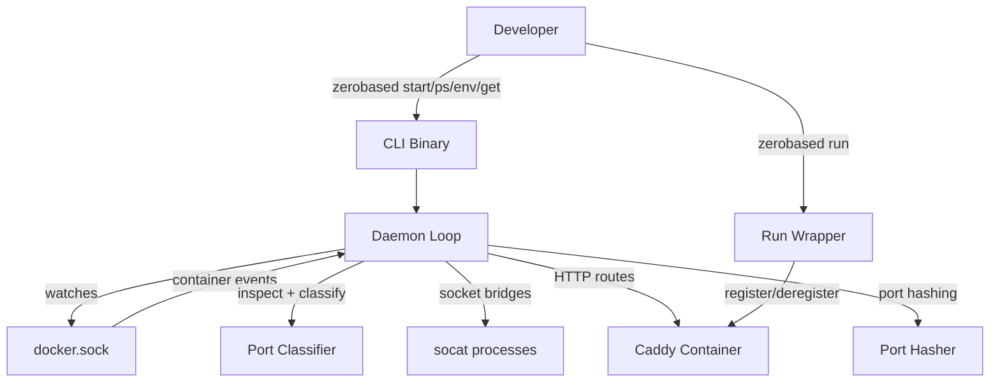

# zerobased

## Goal

Zero-config Docker service routing — watch docker.sock, auto-classify ports, create Unix sockets + HTTP routes, clean up on stop.

## Abstract Constraints

| Constraint | Rationale | Affected Containers |
|------------|-----------|---------------------|
| Zero configuration | Existing docker-compose.yml works as-is, no labels/config files required | c3-1 |
| Auto-cleanup | All sockets and routes removed when containers stop or daemon shuts down | c3-1 |
| Direct container IP | Connect via Docker network IP, not host port mappings — avoids port conflicts | c3-1 |

## Overview

## Containers

| ID | Name | Boundary | Status | Responsibilities | Goal Contribution |
|----|------|----------|--------|------------------|-------------------|
| c3-1 | cli | app | active | Docker event watching, port classification, socat/Caddy orchestration, CLI interface | The single binary that delivers all zero-config routing |
