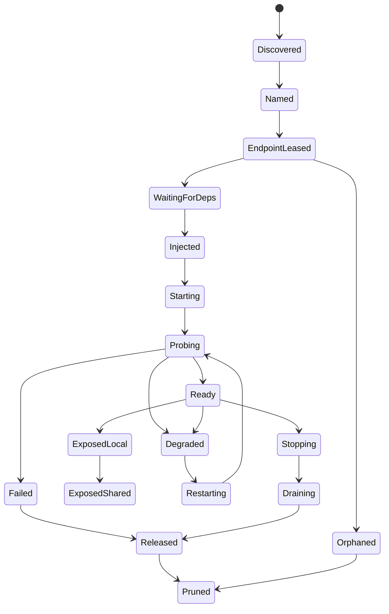

# ADR 0001: Portless Service Fabric

## Status

Implemented for the pure contract layer. Runtime wiring remains future work.

## Product Promise

Zerobased users name services, not ports. In normal workflow, a user or agent should not choose, reserve, document, or repair numeric ports. Zerobased owns private endpoints, readiness, stable URLs, and cleanup.

The visible API becomes service identity:

- `web.<namespace>.localhost`
- `api.<namespace>.localhost`
- `zerobased get api`
- `zerobased env`

Ports remain an internal implementation detail.

## Current Behavior

Current zerobased discovers Docker containers, classifies exposed ports, creates Unix sockets or Caddy HTTP routes, and cleans routes/sockets when containers stop. `zerobased run` can wrap one host dev server, but the current implementation still needs explicit `-p` or stdout URL detection. That behavior is pre-fabric compatibility and should be replaced by controlled pre-start injection/adapters.

That leaves the user-visible failure modes unsolved:

- two worktrees can compete for the same port or hostname
- stale host processes can keep ports alive
- scripts and docs still depend on `localhost:<port>`
- a crashed gateway or wrapped process can leave confusing residue
- Docker and host commands are handled by different mental models

## Decision

Introduce a service-fabric model below future CLI/daemon wiring:

1. Resolve repo, worktree, and service into a stable namespace.
2. Lease a private endpoint to a concrete owner.
3. Inject endpoint data into the process/container before it starts through env aliases, flags, sockets, or listener handoff.
4. Probe readiness separately from process start.
5. Expose stable named URLs through the gateway.
6. Show state through `ps`, `get`, `env`, `logs`, and `prune --dry-run`.
7. Release, orphan, rebuild, or prune by lease state.

The first implementation layer is intentionally pure: `internal/fabric` defines namespace, lifecycle, lease, and endpoint-policy contracts with tests. Runtime integration follows after those contracts are stable.

## Non-Goals

- No public sharing in MVP.
- No deep Turbo/Nx/process-compose ownership in MVP.
- No production service mesh semantics.
- No user-facing fixed port configuration as the normal path.
- No replacement of existing Docker discovery.

## Lifecycle

This diagram is the ADR-level target lifecycle. The current pure contract layer implements the readiness and cleanup states that can be validated without runtime IO: `waiting_for_deps`, `starting`, `probing`, `ready`, `degraded`, `failed`, `restarting`, `stopping`, `released`, `orphaned`, and `pruned`. Discovery, injection, exposure, and draining become runtime states when daemon/run-wrapper wiring lands.



Key rule: `ready` is reachable only after probing. A started process is not ready.

## Lease Owner Model

Every private endpoint lease records owner and cleanup semantics.

| Owner | Meaning | Cleanup signal |
| --- | --- | --- |
| `daemon_session` | gateway/daemon-owned endpoint | daemon stop, clean reset |
| `wrapped_pid` | host command started by zerobased | process exit, signal, crash, timeout |
| `docker_container` | discovered container | Docker `die`, missing container, daemon scan |
| `compose_service` | compose service abstraction | compose stop, missing project, scan |

Cleanup decisions must be reviewable:

| Cause | First decision | Later decision |
| --- | --- | --- |
| clean stop | release | prune after release if residue remains |
| crash | mark orphan | prune after dry-run review |
| expired lease | mark orphan | prune |
| deleted worktree/source | mark orphan | prune |
| gateway restart | rebuild ready/degraded routes | keep failed/stopped leases hidden |

## Namespace Model

Service identity is derived from:

```text
repo + worktree + service
```

Each segment is URL-safe and collision-resistant. Readable slug alone is not enough because `Main`, `main`, and path-like worktree names can collapse. The contract keeps both readable slug and hash-backed label.

Example shape:

```text
api.<worktree-label>.<repo-label>.localhost
```

Two worktrees running the same service must not collide.

## Endpoint Policy

Endpoint allocation assigns named private endpoint resources before the process starts. A config may call these resources `endpoints` rather than `ports` because the resource can become an HTTP proxy, TCP bridge, Unix socket, or transformed connection string. The app may run on random private endpoints, but zerobased organizes them through env aliases and proxy routes. The fabric does not guess ports from process output.

| Policy | Normal path | Notes |
| --- | --- | --- |
| `unix_socket` | yes | best for protocols that support sockets |
| `listener_handoff` | yes | avoids scan-then-bind races |
| `ephemeral_loopback` | yes | OS assigns free private port atomically |
| `env_flag` | yes | framework receives `PORT`, `HOST`, or flags |

Unsupported tools are adapter work, not a fabric policy. An adapter may extract a port setting from a known config file, command shape, or framework convention, then rewrite/inject it before process start. If zerobased cannot control the endpoint before start, the service should fail with adapter guidance.

Endpoint output is consumed through aliases and proxy types:

| Surface | Purpose |
| --- | --- |
| env alias | `API_URL`, `DATABASE_URL`, `ZB_SERVICE_MAP`, or prefixed project variables |
| HTTP proxy | stable `.localhost` host or path route |
| TCP/socket proxy | connection string or Unix socket path for databases and brokers |

Endpoint modes stay generic. App-specific connection strings come from templates, not built-in database types:

| Mode | Default facts |
| --- | --- |
| `http` | `host`, `port`, `host_name`, `url` |
| `tcp` | `host`, `port`, `addr` |
| `socket` | `path`, `dir` |

## Gateway Model

The gateway is a persistent local authority. Its source of truth is the lease registry, not in-memory route state. After restart, it should rebuild routes for ready/degraded leases and avoid exposing failed/orphaned leases.

Exposure modes are separate trust boundaries:

| Mode | Default | Boundary |
| --- | --- | --- |
| local `.localhost` | MVP | loopback only |
| LAN/mDNS | later opt-in | local network |
| Tailscale/Funnel | later opt-in | tailnet or public funnel |
| domain sharing | later opt-in | public DNS/TLS policy |

## MVP Boundary

MVP should prove local-first service identity:

- persistent local daemon/gateway
- stable named `.localhost` URLs
- worktree-aware namespace
- wrapped host command endpoint injection
- current Docker discovery mapped into leases
- private endpoint lease registry
- readiness states: waiting, starting, probing, ready, degraded, failed, orphaned
- `ps`, `get`, `env`, `prune --dry-run`, `prune`, `clean`

## ADR-Level Verification Matrix

Feature completion is proven here, not inside leaf tasks.

| Impact | Required evidence | Current layer |
| --- | --- | --- |
| no port conflict in normal flow | two worktrees run same service; names differ; no user-selected ports | namespace contract testable now; runtime proof blocked on run-wrapper/gateway |
| host and Docker share fabric | one wrapped host command and one Docker service appear in `ps`, `get`, and named URLs | blocked on runtime integration |
| dependency readiness is real | dependent service stays `waiting_for_deps` until upstream probe is ready | lifecycle transition contract testable now; probe enforcement blocked on runtime integration |
| stale state is repairable | crashed process becomes `orphaned`; `prune --dry-run` explains cleanup; `prune` removes residue | lease cleanup decision testable now; prune executor blocked on CLI integration |
| gateway is recoverable | gateway restart rebuilds ready/degraded routes from leases | lease decision testable now; route rebuild blocked on gateway integration |
| no post-start guessing | endpoint is assigned before process start; unsupported tools fail with adapter guidance | endpoint policy contract testable now |

Leaf tasks verify only their local contract. This ADR owns full impact proof.

## Self-Review

- Normal workflow does not ask for port numbers.
- Service names are primary user and script API.
- Every lifecycle state has cleanup semantics.
- Local/shared exposure modes are separate trust boundaries.
- MVP excludes public sharing and deep task-graph orchestration.
- Pure contracts are tested before runtime wiring.
